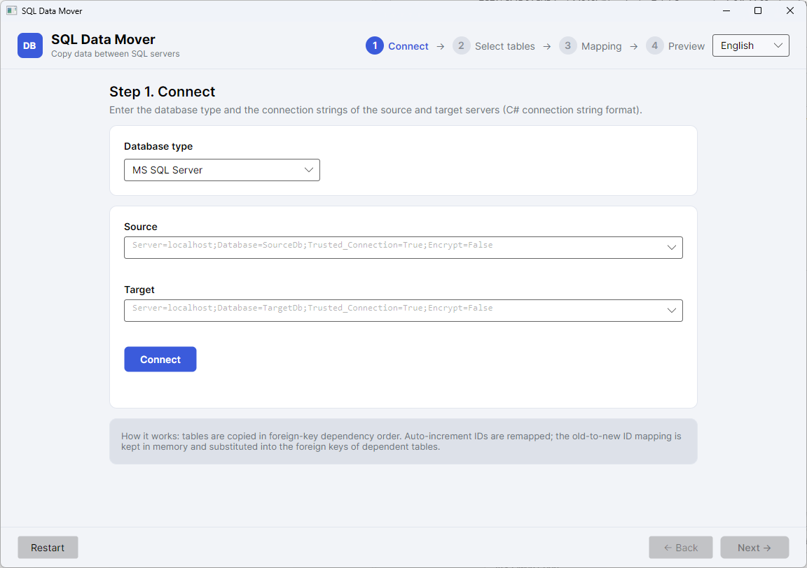

# SQL Data Mover

A **C# (.NET 10, Avalonia UI)** GUI application for copying data from one SQL server to another.

Currently **MS SQL Server** is supported, but the architecture is abstracted behind a database
provider interface — adding other databases (PostgreSQL, MySQL, etc.) requires no changes to the
copy engine.



**Language:** English by default. Russian is available and is selected automatically on the first
run only if your operating system UI language is Russian. You can switch the language anytime from
the top-right corner of the window; the choice is remembered. ([Русская версия](README.ru.md))

## Features

- **Connection strings** for the source and target in the standard C# connection string format.
- **Table tree** (schema → tables) with checkboxes, a filter, and approximate row counts.
- **Match columns** per table — source rows are matched against existing target rows by the
  combination of their values (which does not have to be the primary key):
  - row found → updated (its ID stays the target ID);
  - row missing → inserted with a new auto-increment ID.
- **Auto-increment ID remapping**: original values are not copied; the target generates new ones
  and an "original ID → new ID" mapping is kept in memory.
- **Foreign key substitution**: when dependent tables are copied, the new parent IDs are
  automatically substituted into the child FK columns. Tables are copied in dependency order
  (parents before children), including self-referencing tables (two-phase processing).
- Per-table and per-row progress, an operation log, and copy cancellation.
- Dark/light theme following the system.

## Requirements

- [.NET SDK 10](https://dotnet.microsoft.com/download) (the app is cross-platform:
  Windows / Linux / macOS).

## Build and run

```bash
dotnet build SqlDataMover.slnx
dotnet run --project src/SqlDataMover.App
```

Tests:

```bash
dotnet test tests/SqlDataMover.Core.Tests
```

The integration test (`SqlServerIntegrationTests`) requires a local SQL Server (default instance,
trusted connection). Prepare the test databases before the first run:

```bash
sqlcmd -S localhost -E -i tests/sql/setup-test-databases.sql
```

## Usage

A wizard with four steps:

1. **Connect** — select the database type (currently MS SQL Server) and enter the connection
   strings of the source and target. The "Connect" button verifies both connections and loads
   the tables.
2. **Select tables** — check the tables to copy (schema → tables).
3. **Match columns** — for each table, select one or more match columns (primary key columns by
   default) and click "Next" to run the preview.
4. **Preview and copy** — a dry run (no writes) shows how many rows would be inserted and updated
   per table. Start the real copy afterwards; the result appears in the summary and the log.

Example connection strings:

```
Server=localhost;Database=SourceDb;Trusted_Connection=True;Encrypt=False
Server=localhost;Database=TargetDb;User Id=sa;Password=***;Encrypt=False
```

If `Encrypt` and `TrustServerCertificate` are not specified, the app adds `Encrypt=Optional` and
`TrustServerCertificate=True` — convenient for local servers.

## How it works

1. Tables are sorted topologically by foreign keys (parents before children).
2. For each table, a "match column values → target ID" dictionary is loaded from the target
   (target ID = identity, otherwise primary key, otherwise the first match column). A row with
   NULL in any match column is always inserted.
3. Source rows are read and inserted in batches; the new ID of each inserted row is returned via
   `OUTPUT INSERTED.[col]` and recorded in the mapping.
4. When a child table is copied, its FK columns are replaced with the new IDs from the mapping.
   Self-referencing FKs are filled in a second pass (`UPDATE`).
5. Each table is copied in its own transaction: on error its changes are rolled back and the
   remaining tables continue.

## Project structure

```
src/SqlDataMover.Core/          # core: database provider, copy engine (no UI)
src/SqlDataMover.App/           # Avalonia application (MVVM)
tests/SqlDataMover.Core.Tests/  # unit and integration tests of the core
```

## Adding a new database

Implement the `IDbProvider` interface (metadata, reading, insertion with identity return,
updating by match columns, transactions) and register it in `DbProviderFactory`.

## Limitations

- Target tables must exist: the schema (columns, indexes) is neither created nor migrated.
- Only common columns are copied; computed and target identity columns are skipped.
- The match column combination must be truly unique in the source (otherwise "the last row wins").
- A self-referencing table with a `NOT NULL` FK: a child row encountered in the source before its
  parent will fail to insert.
- `OUTPUT INSERTED` does not work if the target table has an `INSTEAD OF` trigger.
- The ID mapping is held in memory: when copying very large tables, memory usage grows
  proportionally to the number of rows.

## License

See [LICENSE](LICENSE).
