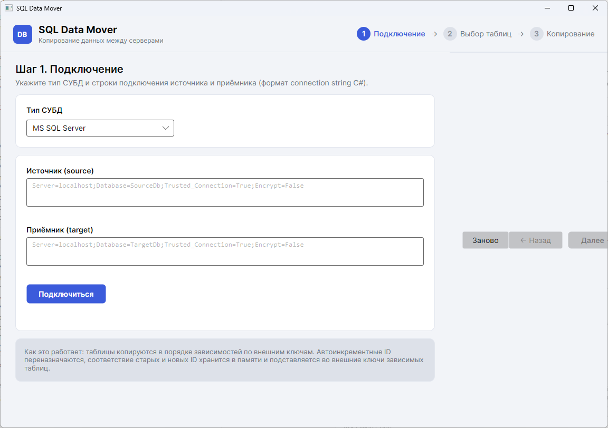

# SQL Data Mover

GUI-приложение на **C# (.NET 10, Avalonia UI)** для копирования данных с одного SQL-сервера на другой.

На данный момент поддерживается **MS SQL Server**, но архитектура абстрагирована через
интерфейс провайдера СУБД — добавление других СУБД (PostgreSQL, MySQL и т.п.) не требует
изменений в движке копирования.



## Возможности

- **Строки подключения** источника и приёмника в стандартном формате connection string C#.
- **Дерево таблиц** (схема → таблицы) с чекбоксами, фильтром и счётчиком строк.
- **Поля сопоставления** для каждой таблицы — по комбинации их значений строки источника
  сопоставляются с уже существующими строками приёмника (может не совпадать с первичным ключом):
  - строка найдена → обновляется (её ID остаётся целевым);
  - строки нет → вставляется с новым автоинкрементным ID.
- **Переназначение автоинкрементных ID**: оригинальные значения не копируются, в приёмнике
  генерируются новые, в памяти строится соответствие «оригинальный ID → новый ID».
- **Подстановка внешних ключей**: при копировании зависимых таблиц новые ID родителей
  автоматически подставляются в FK-колонки детей. Таблицы копируются в порядке зависимостей
  (родители раньше детей), включая самоссылающиеся таблицы (двухфазная обработка).
- Прогресс по таблицам и строкам, журнал операций, отмена копирования.
- Тёмная/светлая тема по системе.

## Требования

- [.NET SDK 10](https://dotnet.microsoft.com/download) (приложение кроссплатформенное:
  Windows / Linux / macOS).

## Сборка и запуск

```bash
dotnet build SqlDataMover.slnx
dotnet run --project src/SqlDataMover.App
```

Тесты:

```bash
dotnet test tests/SqlDataMover.Core.Tests
```

## Использование

Мастер из трёх шагов:

1. **Подключение** — выберите тип СУБД (пока MS SQL Server) и укажите строки подключения
   источника и приёмника. Кнопка «Подключиться» проверит оба соединения и загрузит таблицы.
2. **Выбор таблиц** — отметьте галочками таблицы для копирования (схема → таблицы).
3. **Поля и копирование** — для каждой таблицы отметьте одно или несколько полей сопоставления
   (по умолчанию — колонки первичного ключа) и нажмите «Запустить копирование».
   Результат — в сводке и журнале.

Примеры строк подключения:

```
Server=localhost;Database=SourceDb;Trusted_Connection=True;Encrypt=False
Server=localhost;Database=TargetDb;User Id=sa;Password=***;Encrypt=False
```

Если в строке не указаны `Encrypt` и `TrustServerCertificate`, приложение подставит
`Encrypt=Optional` и `TrustServerCertificate=True` — удобно для локальных серверов.

## Как это работает

1. Таблицы сортируются топологически по внешним ключам (родители раньше детей).
2. Для каждой таблицы в приёмнике загружается словарь «комбинация значений полей сопоставления →
   целевой ID» (целевой ID = identity, иначе первичный ключ, иначе первое поле сопоставления).
   Строка с NULL в любом поле сопоставления всегда вставляется.
3. Строки источника читаются потоково и вставляются пакетами; новый ID каждой вставленной
   строки возвращается через `OUTPUT INSERTED.[col]` и запоминается в сопоставлении.
4. При копировании дочерней таблицы значения её FK-колонок заменяются на новые ID из
   сопоставления. Самоссылающиеся FK заполняются вторым проходом (`UPDATE`).
5. Каждая таблица копируется в своей транзакции: при ошибке её изменения откатываются,
   остальные таблицы продолжают копироваться.

## Структура проекта

```
src/SqlDataMover.Core/          # ядро: провайдер СУБД, движок копирования (без UI)
src/SqlDataMover.App/           # Avalonia-приложение (MVVM)
tests/SqlDataMover.Core.Tests/  # юнит- и интеграционные тесты ядра
```

## Добавление новой СУБД

Реализуйте интерфейс `IDbProvider` (метаданные, чтение, вставка с возвратом identity,
обновление по полям сопоставления, транзакции) и зарегистрируйте его в `DbProviderFactory`.

## Ограничения

- Целевые таблицы должны существовать: схема (колонки, индексы) не создаётся и не мигрируется.
- Копируются только общие колонки; вычисляемые и identity-колонки приёмника пропускаются.
- Комбинация полей сопоставления должна быть действительно уникальной в источнике (иначе
  «последняя строка побеждает»).
- Самоссылающаяся таблица с `NOT NULL` FK: строка-ребёнок, встреченная в источнике раньше
  родителя, вызовет ошибку вставки.
- `OUTPUT INSERTED` не работает, если на таблице приёмника есть триггер `INSTEAD OF`.
- Сопоставление ID хранится в памяти: при копировании очень больших таблиц объём памяти
  растёт пропорционально числу строк.

## Лицензия

См. [LICENSE](LICENSE).
