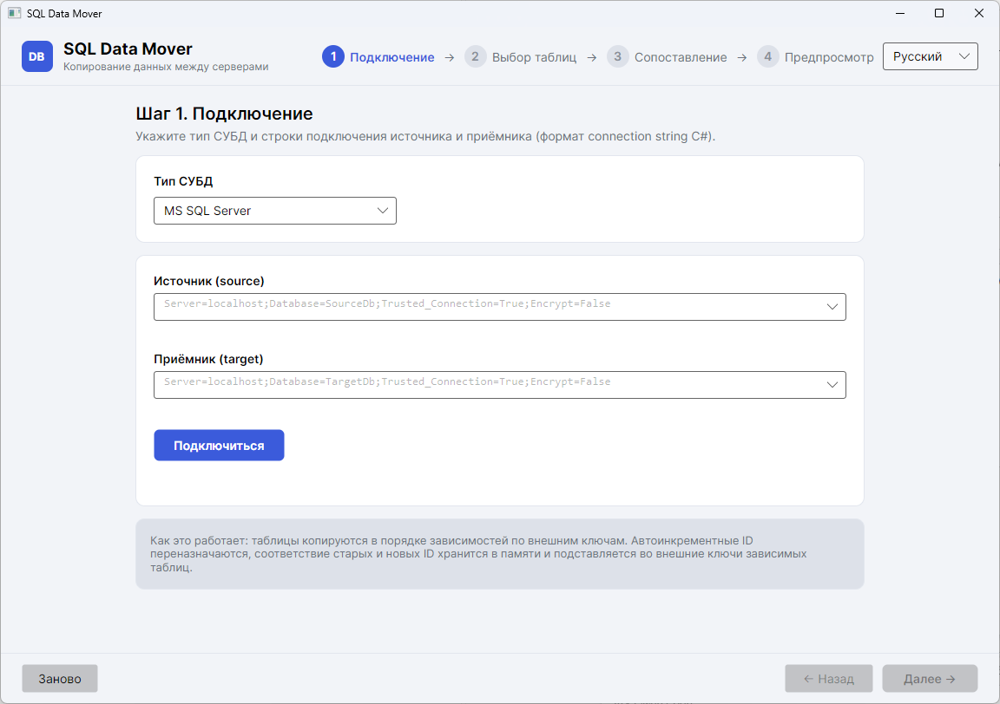

# SQL Data Mover

GUI-приложение на **C# (.NET 10, Avalonia UI)** для копирования данных с одного SQL-сервера на другой.

На данный момент поддерживается **MS SQL Server**, но архитектура абстрагирована через
интерфейс провайдера СУБД — добавление других СУБД (PostgreSQL, MySQL и т.п.) не требует
изменений в движке копирования.



**Язык:** по умолчанию — английский. Русский доступен и выбирается автоматически при первом
запуске, только если интерфейс операционной системы на русском. Переключить язык можно в любой
момент в правом верхнем углу окна; выбор запоминается. ([English version](README.md))

## Возможности

- **Строки подключения** источника и приёмника в стандартном формате connection string C#.
- **Дерево таблиц** (схема → таблицы) с чекбоксами, фильтром и счётчиком строк.
- **Поля сопоставления** для каждой таблицы — по комбинации их значений строки источника
  сопоставляются с уже существующими строками приёмника (может не совпадать с первичным ключом):
  - строка найдена → обновляется (её ID остаётся целевым);
  - строки нет → вставляется с новым автоинкрементным ID.
- **Переназначение автоинкрементных ID**: оригинальные значения не копируются, в приёмнике
  генерируются новые, в памяти строится соответствие «оригинальный ID → новый ID».
- **Сохранение identity**: если выбрать автоинкрементную (identity) колонку полем сопоставления,
  её значения копируются из источника как есть (`SET IDENTITY_INSERT`); после копирования
  счётчик identity приёмника выравнивается по источнику, чтобы последующие ID совпадали.
- **Подстановка внешних ключей**: при копировании зависимых таблиц новые ID родителей
  автоматически подставляются в FK-колонки детей. Таблицы копируются в порядке зависимостей
  (родители раньше детей), включая самоссылающиеся таблицы (двухфазная обработка).
- **Временное задвоение уникальных значений**: для таблиц с уникальными полями уникальные
  индексы приёмника (кроме первичного ключа) можно отключать на время копирования таблицы
  и пересоздавать перед коммитом транзакции. Нужно, когда уникальное поле временно
  задваивается в процессе копирования (например, новая строка вставляется со значением,
  которое ещё не освободила обновляемая устаревшая строка). Требует права ALTER на таблицы
  приёмника.
- Прогресс по таблицам и строкам, журнал операций, отмена копирования.
- Тёмная/светлая тема по системе.

## Требования

- [.NET SDK 10](https://dotnet.microsoft.com/download) (приложение кроссплатформенное:
  Windows / Linux / macOS).

## Сборка и запуск

```bash
dotnet build SqlDataMover.slnx
dotnet run --project src/SqlDataMover.App
```

Тесты:

```bash
dotnet test tests/SqlDataMover.Core.Tests
```

Интеграционный тест (`SqlServerIntegrationTests`) требует локальный SQL Server (экземпляр по
умолчанию, trusted connection). Перед первым запуском подготовьте тестовые БД:

```bash
sqlcmd -S localhost -E -i tests/sql/setup-test-databases.sql
```

## Выпуск новой версии

Релизы собираются из git-тегов: push тега `v<мажор>[.<минор>[.<патч>]][-prerelease]`
(например `v1.2.3`, `v1.2.3-rc.1`) запускает [workflow релиза](.github/workflows/release.yml) —
сборка, тесты, публикация самодостаточного `win-x64` и GitHub Release со списком изменений.

Как выпустить новую версию:

1. Установите инструмент версионирования:

   ```bash
   dotnet tool install -g dotnet-version-cli
   ```

2. Поднимите версию. Инструмент правит версию в `Directory.Build.props`, затем создаёт
   коммит `vX.Y.Z` и тег с тем же именем:

   ```bash
   dotnet version patch   # "patch", "minor" или "major"
   ```

3. Запуште ветку и тег — остальное сделает workflow релиза:

   ```bash
   git push && git push --tags
   ```

## Использование

Мастер из четырёх шагов:

1. **Подключение** — выберите тип СУБД (пока MS SQL Server) и укажите строки подключения
   источника и приёмника. Кнопка «Подключиться» проверит оба соединения и загрузит таблицы.
2. **Выбор таблиц** — отметьте галочками таблицы для копирования (схема → таблицы).
3. **Поля сопоставления** — для каждой таблицы отметьте одно или несколько полей сопоставления
   (по умолчанию — колонки первичного ключа) и нажмите «Далее», чтобы запустить предпросмотр.
4. **Предпросмотр и копирование** — предварительный прогон (без записи) показывает, сколько
   строк в каждой таблице будет вставлено и обновлено. После просмотра статистики запустите
   копирование; результат — в сводке и журнале.

Примеры строк подключения:

```
Server=localhost;Database=SourceDb;Trusted_Connection=True;Encrypt=False
Server=localhost;Database=TargetDb;User Id=sa;Password=***;Encrypt=False
```

Если в строке не указаны `Encrypt` и `TrustServerCertificate`, приложение подставит
`Encrypt=Optional` и `TrustServerCertificate=True` — удобно для локальных серверов.

## Как это работает

1. Таблицы сортируются топологически по внешним ключам (родители раньше детей).
2. Для каждой таблицы в приёмнике загружается словарь «комбинация значений полей сопоставления →
   целевой ID» (целевой ID = identity, иначе первичный ключ, иначе первое поле сопоставления).
   Строка с NULL в любом поле сопоставления всегда вставляется.
3. Строки источника читаются потоково и вставляются пакетами; новый ID каждой вставленной
   строки возвращается через `OUTPUT INSERTED.[col]` и запоминается в сопоставлении.
   Если identity-колонка выбрана полем сопоставления, значения identity копируются как есть
   (`SET IDENTITY_INSERT`), а после копирования счётчик identity приёмника выравнивается
   по источнику (`DBCC CHECKIDENT ... RESEED`).
4. При копировании дочерней таблицы значения её FK-колонок заменяются на новые ID из
   сопоставления. Самоссылающиеся FK заполняются вторым проходом (`UPDATE`).
5. Каждая таблица копируется в своей транзакции: при ошибке её изменения откатываются,
   остальные таблицы продолжают копироваться. Если включена опция «Разрешить временное
   задвоение уникальных значений», уникальные индексы приёмника (кроме первичного ключа)
   отключаются в начале копирования таблицы и пересоздаются перед коммитом — транзиентное
   задвоение уникального значения (новая строка вставлена раньше, чем обновление освободило
   значение у устаревшей строки) не роняет копирование. Реальные дубликаты, оставшиеся
   в конце, уронят пересоздание индекса, и транзакция таблицы откатится.

## Структура проекта

```
src/SqlDataMover.Core/          # ядро: провайдер СУБД, движок копирования (без UI)
src/SqlDataMover.App/           # Avalonia-приложение (MVVM)
tests/SqlDataMover.Core.Tests/  # юнит- и интеграционные тесты ядра
```

## Добавление новой СУБД

Реализуйте интерфейс `IDbProvider` (метаданные, чтение, вставка с возвратом identity,
обновление по полям сопоставления, транзакции) и зарегистрируйте его в `DbProviderFactory`.

## Ограничения

- Целевые таблицы должны существовать: схема (колонки, индексы) не создаётся и не мигрируется.
- Копируются только общие колонки; вычисляемые и identity-колонки приёмника пропускаются
  (исключение — identity, выбранная полем сопоставления: тогда она копируется как есть).
- Комбинация полей сопоставления должна быть действительно уникальной в источнике (иначе
  «последняя строка побеждает»).
- Самоссылающаяся таблица с `NOT NULL` FK: строка-ребёнок, встреченная в источнике раньше
  родителя, вызовет ошибку вставки.
- `OUTPUT INSERTED` не работает, если на таблице приёмника есть триггер `INSTEAD OF`.
- Сопоставление ID хранится в памяти: при копировании очень больших таблиц объём памяти
  растёт пропорционально числу строк.

## Лицензия

См. [LICENSE](LICENSE).
